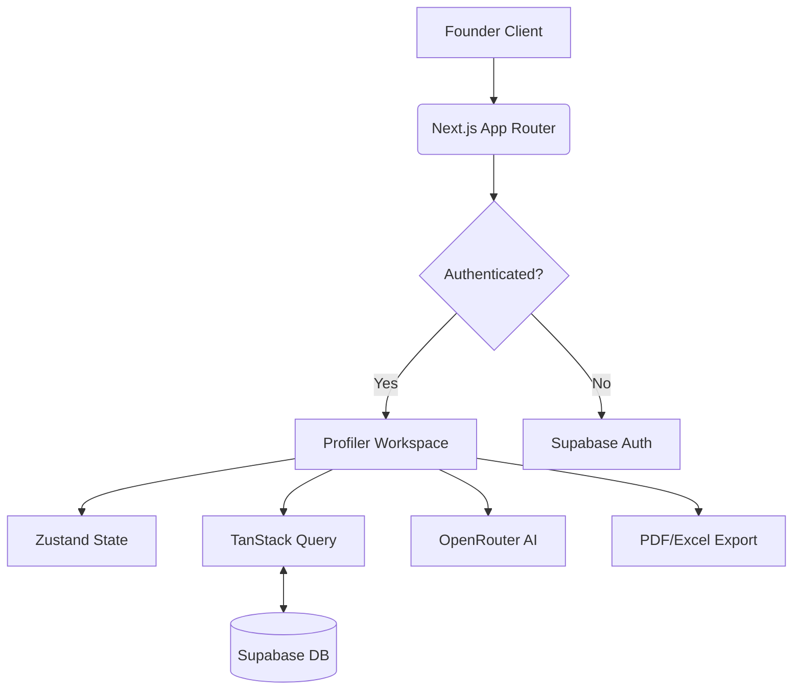

# 🚀 InUnity Startup Diagnosis Profiler 

[](https://nextjs.org/)
[](https://www.typescriptlang.org/)
[](https://tailwindcss.com/)
[](https://supabase.com/)
[](LICENSE)

> **Empowering Founders with AI-Driven Diagnostics.**  
> A high-performance, full-stack Next.js application designed to profile, score, and provide actionable roadmaps for early-stage startups.

---

## 🌟 Project Overview

The **InUnity Startup Diagnosis Profiler** is a sophisticated screening and mentorship tool. It transitions startups through a multi-stage diagnostic flow, measuring fundamentals across 7 critical domains. By combining real-time qualitative input with quantitative scoring and AI-powered insights, it provides mentors and founders with a unified "Health Score" and a generated growth roadmap.

### 🎯 Core Objectives
- **Standardized Diagnostic**: Level the playing field with objective scoring.
- **AI-Powered Mentorship**: Leverage LLMs for instant gap analysis and recommendations.
- **Seamless Portability**: Instant PDF/Excel generation for pitch preparation.
- **Real-time Collaboration**: Auto-save workspace for frictionless data entry.

---

## 🏗️ Modern Architecture

This project has been migrated from a legacy React+FastAPI stack to a **Unified Next.js 14 Full-Stack Architecture**, optimized for Vercel deployment and maximum performance.



---

## 🚀 Key Features

### 1. The 7-Section Diagnostic Engine
A comprehensive flow covering every facet of a startup's lifecycle:
1. **Founder Profile**: Identifying the core team and domain expertise.
2. **Problem & Solution**: Assessing the pain point intensity and solution clarity.
3. **Market Validation**: Scoring customer interviews and market sizing.
4. **Business Model**: Evaluating unit economics and revenue strategies.
5. **IncubX Startup Readiness**: Tracking TRL, BRL, and CRL progress.
6. **The Pitch Deck**: Auditing the quality of storytelling and investor-readiness.
7. **Final Diagnosis**: Consolidating overall strengths, gaps, and next steps.

### 2. Intelligent AI Analysis
Powered by **OpenRouter**, the system utilizes a multi-model fallback strategy:
- **Primary**: Llama 3.1 8B Instruct (High performance).
- **Secondary**: Mistral / Gemma Fallback.
- **Tertiary**: Rule-based heuristic engine if API limits are reached.
- *Insight*: Generates Strengths, Gaps, and Immediate Recommendations in seconds.

### 3. Professional Exports
- **Diagnostic Brief (PDF)**: High-quality portable document generated via `@react-pdf/renderer` with dynamic streaming.
- **Analysis Sheet (Excel)**: Full data export using `xlsx` engine for mentor auditing.

### 4. Robust Real-time Backend
- **Supabase Auth**: Secure, session-aware authentication.
- **Auto-Sync**: Debounced real-time persistence (800ms) ensuring zero data loss.
- **JSONB Roadmap**: Flexible, schema-less growth tracking for unlimited roadmap items.

---

## 🎨 Design System

We utilize the **InUnity Premium Palette**, a curated selection of colors designed for professional impact:

| Color | Hex | Usage |
| :--- | :--- | :--- |
| **InUnity Navy** | `#0F2647` | Primary surfaces, deep text |
| **Marigold Gold** | `#E8A020` | Highlights, warnings, primary CTA |
| **Deep Teal** | `#1A7A6E` | Success states, strong scores |
| **Coral Sunset** | `#E84B3A` | Critical gaps, low scores |
| **Smoke White**| `#F4F6F9` | Backgrounds, secondary containers |

---

## 🛠️ Technical Stack

- **Framework**: [Next.js 14](https://nextjs.org/) (App Router)
- **State Management**: [Zustand](https://github.com/pmndrs/zustand)
- **Server State**: [TanStack Query v5](https://tanstack.com/query/latest)
- **Styling**: [Tailwind CSS](https://tailwindcss.com/)
- **Database/Auth**: [Supabase](https://supabase.com/)
- **AI Engine**: [OpenRouter](https://openrouter.ai/)
- **PDF Engine**: [@react-pdf/renderer](https://react-pdf.org/)
- **Excel Engine**: [SheetJS (XLSX)](https://sheetjs.com/)

---

## 🚦 Getting Started

### Prerequisites
- Node.js 18.x or 20.x
- A Supabase Project
- An OpenRouter API Key

### Installation

1. **Clone and Enter the Directory**
   ```bash
   git clone <repo-url>
   cd StartupProfiling/inunity-profiler
   ```

2. **Install Dependencies**
   ```bash
   npm install
   ```

3. **Configure Environment Variables**
   Create a `.env.local` file:
   ```env
   NEXT_PUBLIC_SUPABASE_URL=your_url
   NEXT_PUBLIC_SUPABASE_ANON_KEY=your_anon_key
   SUPABASE_SERVICE_ROLE_KEY=your_secret_key
   OPENROUTER_API_KEY=your_sk_or_key
   NEXT_PUBLIC_APP_URL=http://localhost:3000
   ```

4. **Run Development Server**
   ```bash
   npm run dev
   ```

---

## 📁 Repository Structure

```text
inunity-profiler/
├── src/
│   ├── app/                # App Router (Pages & API Routes)
│   ├── components/         # Atomic components (Form, UI, AI, Preview)
│   ├── hooks/              # Custom React Hooks (Auth, Teams)
│   ├── lib/                # Third-party clients (Supabase, AI)
│   ├── store/              # Zustand global state
│   ├── types/              # TypeScript definitions
│   └── utils/              # Scoring logic and formatters
├── public/                 # Static assets
├── tailwind.config.ts      # Design system configuration
└── next.config.mjs         # Hardened build configuration
```

---

## 🚢 Deployment (Vercel)

This project is optimized for **Zero-Config Vercel Deployment**:
1. Connect your GitHub repository to Vercel.
2. The `next.config.mjs` has been pre-configured with webpack aliases for `@react-pdf/renderer`.
3. Add your environment variables in the Vercel dashboard.
4. Deploy!

---

## 📄 License
Released under the [MIT License](LICENSE).

---
© 2026 InUnity Private Limited. All Rights Reserved.
